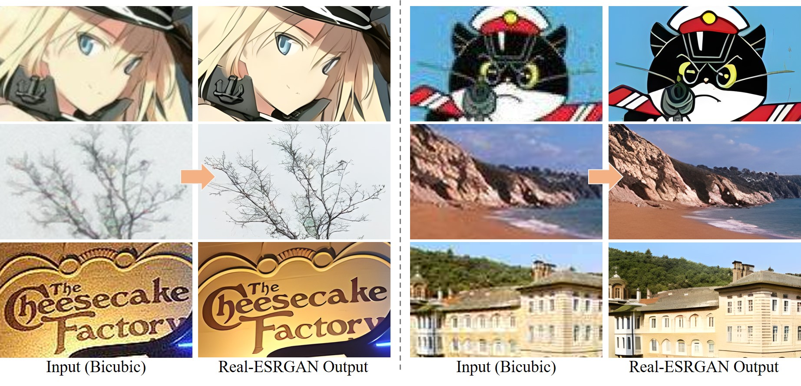

<p align="center">
  
</p>

## <div align="center"><b><a href="README.md">English</a> | <a href="README_CN.md">简体中文</a></b></div>

<div align="center">

👀[**Demos**](#-demos-videos) **|** 🚩[**Updates**](#-updates) **|** ⚡[**Usage**](#-quick-inference) **|** 🏰[**Model Zoo**](docs/model_zoo.md) **|** 🔧[Install](#-dependencies-and-installation)  **|** 💻[Train](docs/Training.md) **|** ❓[FAQ](docs/FAQ.md) **|** 🎨[Contribution](docs/CONTRIBUTING.md)

[](https://github.com/xinntao/Real-ESRGAN/releases)
[](https://pypi.org/project/realesrgan/)
[](https://github.com/xinntao/Real-ESRGAN/issues)
[](https://github.com/xinntao/Real-ESRGAN/issues)
[](https://github.com/xinntao/Real-ESRGAN/blob/master/LICENSE)
[](https://github.com/xinntao/Real-ESRGAN/blob/master/.github/workflows/pylint.yml)
[](https://github.com/xinntao/Real-ESRGAN/blob/master/.github/workflows/publish-pip.yml)

</div>

🔥 **AnimeVideo-v3 model (动漫视频小模型)**. Please see [[*anime video models*](docs/anime_video_model.md)] and [[*comparisons*](docs/anime_comparisons.md)]<br>
🔥 **RealESRGAN_x4plus_anime_6B** for anime images **(动漫插图模型)**. Please see [[*anime_model*](docs/anime_model.md)]

1. You can try in our website: [ARC Demo](https://arc.tencent.com/en/ai-demos/imgRestore) (now only support RealESRGAN_x4plus_anime_6B)
1. [Colab Demo](https://colab.research.google.com/drive/1k2Zod6kSHEvraybHl50Lys0LerhyTMCo?usp=sharing) for Real-ESRGAN **|** [Colab Demo](https://colab.research.google.com/drive/1yNl9ORUxxlL4N0keJa2SEPB61imPQd1B?usp=sharing) for Real-ESRGAN (**anime videos**)
1. Portable [Windows](https://github.com/xinntao/Real-ESRGAN/releases/download/v0.2.5.0/realesrgan-ncnn-vulkan-20220424-windows.zip) / [Linux](https://github.com/xinntao/Real-ESRGAN/releases/download/v0.2.5.0/realesrgan-ncnn-vulkan-20220424-ubuntu.zip) / [MacOS](https://github.com/xinntao/Real-ESRGAN/releases/download/v0.2.5.0/realesrgan-ncnn-vulkan-20220424-macos.zip) **executable files for Intel/AMD/Nvidia GPU**. You can find more information [here](#portable-executable-files-ncnn). The ncnn implementation is in [Real-ESRGAN-ncnn-vulkan](https://github.com/xinntao/Real-ESRGAN-ncnn-vulkan)
1. You can watch enhanced animations in [Tencent Video](https://v.qq.com/s/topic/v_child/render/fC4iyCAM.html). 欢迎观看[腾讯视频动漫修复](https://v.qq.com/s/topic/v_child/render/fC4iyCAM.html)

Real-ESRGAN aims at developing **Practical Algorithms for General Image/Video Restoration**.<br>
We extend the powerful ESRGAN to a practical restoration application (namely, Real-ESRGAN), which is trained with pure synthetic data.

🌌 Thanks for your valuable feedbacks/suggestions. All the feedbacks are updated in [feedback.md](docs/feedback.md).

---

If Real-ESRGAN is helpful, please help to ⭐ this repo or recommend it to your friends 😊 <br>
Other recommended projects:<br>
▶️ [GFPGAN](https://github.com/TencentARC/GFPGAN): A practical algorithm for real-world face restoration <br>
▶️ [BasicSR](https://github.com/xinntao/BasicSR): An open-source image and video restoration toolbox<br>
▶️ [facexlib](https://github.com/xinntao/facexlib): A collection that provides useful face-relation functions.<br>
▶️ [HandyView](https://github.com/xinntao/HandyView): A PyQt5-based image viewer that is handy for view and comparison <br>
▶️ [HandyFigure](https://github.com/xinntao/HandyFigure): Open source of paper figures <br>

---

### 📖 Real-ESRGAN: Training Real-World Blind Super-Resolution with Pure Synthetic Data

> [[Paper](https://arxiv.org/abs/2107.10833)] &emsp; [[YouTube Video](https://www.youtube.com/watch?v=fxHWoDSSvSc)] &emsp; [[B站讲解](https://www.bilibili.com/video/BV1H34y1m7sS/)] &emsp; [[Poster](https://xinntao.github.io/projects/RealESRGAN_src/RealESRGAN_poster.pdf)] &emsp; [[PPT slides](https://docs.google.com/presentation/d/1QtW6Iy8rm8rGLsJ0Ldti6kP-7Qyzy6XL/edit?usp=sharing&ouid=109799856763657548160&rtpof=true&sd=true)]<br>
> [Xintao Wang](https://xinntao.github.io/), Liangbin Xie, [Chao Dong](https://scholar.google.com.hk/citations?user=OSDCB0UAAAAJ), [Ying Shan](https://scholar.google.com/citations?user=4oXBp9UAAAAJ&hl=en) <br>
> [Tencent ARC Lab](https://arc.tencent.com/en/ai-demos/imgRestore); Shenzhen Institutes of Advanced Technology, Chinese Academy of Sciences

<p align="center">
  
</p>

---

<!---------------------------------- Updates --------------------------->
## 🚩 Updates

- ✅ Update the **RealESRGAN AnimeVideo-v3** model. Please see [anime video models](docs/anime_video_model.md) and [comparisons](docs/anime_comparisons.md) for more details.
- ✅ Add small models for anime videos. More details are in [anime video models](docs/anime_video_model.md).
- ✅ Add the ncnn implementation [Real-ESRGAN-ncnn-vulkan](https://github.com/xinntao/Real-ESRGAN-ncnn-vulkan).
- ✅ Add [*RealESRGAN_x4plus_anime_6B.pth*](https://github.com/xinntao/Real-ESRGAN/releases/download/v0.2.2.4/RealESRGAN_x4plus_anime_6B.pth), which is optimized for **anime** images with much smaller model size. More details and comparisons with [waifu2x](https://github.com/nihui/waifu2x-ncnn-vulkan) are in [**anime_model.md**](docs/anime_model.md)
- ✅ Support finetuning on your own data or paired data (*i.e.*, finetuning ESRGAN). See [here](docs/Training.md#Finetune-Real-ESRGAN-on-your-own-dataset)
- ✅ Integrate [GFPGAN](https://github.com/TencentARC/GFPGAN) to support **face enhancement**.
- ✅ Integrated to [Huggingface Spaces](https://huggingface.co/spaces) with [Gradio](https://github.com/gradio-app/gradio). See [Gradio Web Demo](https://huggingface.co/spaces/akhaliq/Real-ESRGAN). Thanks [@AK391](https://github.com/AK391)
- ✅ Support arbitrary scale with `--outscale` (It actually further resizes outputs with `LANCZOS4`). Add *RealESRGAN_x2plus.pth* model.
- ✅ [The inference code](inference_realesrgan.py) supports: 1) **tile** options; 2) images with **alpha channel**; 3) **gray** images; 4) **16-bit** images.
- ✅ The training codes have been released. A detailed guide can be found in [Training.md](docs/Training.md).

---

<!---------------------------------- Demo videos --------------------------->
## 👀 Demos Videos

#### Bilibili

- [大闹天宫片段](https://www.bilibili.com/video/BV1ja41117zb)
- [Anime dance cut 动漫魔性舞蹈](https://www.bilibili.com/video/BV1wY4y1L7hT/)
- [海贼王片段](https://www.bilibili.com/video/BV1i3411L7Gy/)

#### YouTube

## 🔧 Dependencies and Installation

- Python >= 3.7 (Recommend to use [Anaconda](https://www.anaconda.com/download/#linux) or [Miniconda](https://docs.conda.io/en/latest/miniconda.html))
- [PyTorch >= 1.7](https://pytorch.org/)

### Installation

1. Clone repo

    ```bash
    git clone https://github.com/xinntao/Real-ESRGAN.git
    cd Real-ESRGAN
    ```

1. Install dependent packages

    ```bash
    # Install basicsr - https://github.com/xinntao/BasicSR
    # We use BasicSR for both training and inference
    pip install basicsr
    # facexlib and gfpgan are for face enhancement
    pip install facexlib
    pip install gfpgan
    pip install -r requirements.txt
    python setup.py develop
    ```

---

## ⚡ Quick Inference

There are usually three ways to inference Real-ESRGAN.

1. [Online inference](#online-inference)
1. [Portable executable files (NCNN)](#portable-executable-files-ncnn)
1. [Python script](#python-script)

### Online inference

1. You can try in our website: [ARC Demo](https://arc.tencent.com/en/ai-demos/imgRestore) (now only support RealESRGAN_x4plus_anime_6B)
1. [Colab Demo](https://colab.research.google.com/drive/1k2Zod6kSHEvraybHl50Lys0LerhyTMCo?usp=sharing) for Real-ESRGAN **|** [Colab Demo](https://colab.research.google.com/drive/1yNl9ORUxxlL4N0keJa2SEPB61imPQd1B?usp=sharing) for Real-ESRGAN (**anime videos**).

### Portable executable files (NCNN)

You can download [Windows](https://github.com/xinntao/Real-ESRGAN/releases/download/v0.2.5.0/realesrgan-ncnn-vulkan-20220424-windows.zip) / [Linux](https://github.com/xinntao/Real-ESRGAN/releases/download/v0.2.5.0/realesrgan-ncnn-vulkan-20220424-ubuntu.zip) / [MacOS](https://github.com/xinntao/Real-ESRGAN/releases/download/v0.2.5.0/realesrgan-ncnn-vulkan-20220424-macos.zip) **executable files for Intel/AMD/Nvidia GPU**.

This executable file is **portable** and includes all the binaries and models required. No CUDA or PyTorch environment is needed.<br>

You can simply run the following command (the Windows example, more information is in the README.md of each executable files):

```bash
./realesrgan-ncnn-vulkan.exe -i input.jpg -o output.png -n model_name
```

We have provided five models:

1. realesrgan-x4plus  (default)
2. realesrnet-x4plus
3. realesrgan-x4plus-anime (optimized for anime images, small model size)
4. realesr-animevideov3 (animation video)

You can use the `-n` argument for other models, for example, `./realesrgan-ncnn-vulkan.exe -i input.jpg -o output.png -n realesrnet-x4plus`

#### Usage of portable executable files

1. Please refer to [Real-ESRGAN-ncnn-vulkan](https://github.com/xinntao/Real-ESRGAN-ncnn-vulkan#computer-usages) for more details.
1. Note that it does not support all the functions (such as `outscale`) as the python script `inference_realesrgan.py`.

```console
Usage: realesrgan-ncnn-vulkan.exe -i infile -o outfile [options]...

  -h                   show this help
  -i input-path        input image path (jpg/png/webp) or directory
  -o output-path       output image path (jpg/png/webp) or directory
  -s scale             upscale ratio (can be 2, 3, 4. default=4)
  -t tile-size         tile size (>=32/0=auto, default=0) can be 0,0,0 for multi-gpu
  -m model-path        folder path to the pre-trained models. default=models
  -n model-name        model name (default=realesr-animevideov3, can be realesr-animevideov3 | realesrgan-x4plus | realesrgan-x4plus-anime | realesrnet-x4plus)
  -g gpu-id            gpu device to use (default=auto) can be 0,1,2 for multi-gpu
  -j load:proc:save    thread count for load/proc/save (default=1:2:2) can be 1:2,2,2:2 for multi-gpu
  -x                   enable tta mode"
  -f format            output image format (jpg/png/webp, default=ext/png)
  -v                   verbose output
```

Note that it may introduce block inconsistency (and also generate slightly different results from the PyTorch implementation), because this executable file first crops the input image into several tiles, and then processes them separately, finally stitches together.

### Python script

#### Usage of python script

1. You can use X4 model for **arbitrary output size** with the argument `outscale`. The program will further perform cheap resize operation after the Real-ESRGAN output.

```console
Usage: python inference_realesrgan.py -n RealESRGAN_x4plus -i infile -o outfile [options]...

A common command: python inference_realesrgan.py -n RealESRGAN_x4plus -i infile --outscale 3.5 --face_enhance

  -h                   show this help
  -i --input           Input image or folder. Default: inputs
  -o --output          Output folder. Default: results
  -n --model_name      Model name. Default: RealESRGAN_x4plus
  -s, --outscale       The final upsampling scale of the image. Default: 4
  --suffix             Suffix of the restored image. Default: out
  -t, --tile           Tile size, 0 for no tile during testing. Default: 0
  --face_enhance       Whether to use GFPGAN to enhance face. Default: False
  --fp32               Use fp32 precision during inference. Default: fp16 (half precision).
  --ext                Image extension. Options: auto | jpg | png, auto means using the same extension as inputs. Default: auto
```

#### Inference general images

Download pre-trained models: [RealESRGAN_x4plus.pth](https://github.com/xinntao/Real-ESRGAN/releases/download/v0.1.0/RealESRGAN_x4plus.pth)

```bash
wget https://github.com/xinntao/Real-ESRGAN/releases/download/v0.1.0/RealESRGAN_x4plus.pth -P experiments/pretrained_models
```

Inference!

```bash
python inference_realesrgan.py -n RealESRGAN_x4plus -i inputs --face_enhance
```

Results are in the `results` folder

#### Inference anime images

<p align="center">
  
</p>

Pre-trained models: [RealESRGAN_x4plus_anime_6B](https://github.com/xinntao/Real-ESRGAN/releases/download/v0.2.2.4/RealESRGAN_x4plus_anime_6B.pth)<br>
 More details and comparisons with [waifu2x](https://github.com/nihui/waifu2x-ncnn-vulkan) are in [**anime_model.md**](docs/anime_model.md)

```bash
# download model
wget https://github.com/xinntao/Real-ESRGAN/releases/download/v0.2.2.4/RealESRGAN_x4plus_anime_6B.pth -P experiments/pretrained_models
# inference
python inference_realesrgan.py -n RealESRGAN_x4plus_anime_6B -i inputs
```

Results are in the `results` folder

---

## BibTeX

    @InProceedings{wang2021realesrgan,
        author    = {Xintao Wang and Liangbin Xie and Chao Dong and Ying Shan},
        title     = {Real-ESRGAN: Training Real-World Blind Super-Resolution with Pure Synthetic Data},
        booktitle = {International Conference on Computer Vision Workshops (ICCVW)},
        date      = {2021}
    }

## 📧 Contact

If you have any question, please email `xintao.wang@outlook.com` or `xintaowang@tencent.com`.

<!---------------------------------- Projects that use Real-ESRGAN --------------------------->
## 🧩 Projects that use Real-ESRGAN

If you develop/use Real-ESRGAN in your projects, welcome to let me know.

- NCNN-Android: [RealSR-NCNN-Android](https://github.com/tumuyan/RealSR-NCNN-Android) by [tumuyan](https://github.com/tumuyan)
- VapourSynth: [vs-realesrgan](https://github.com/HolyWu/vs-realesrgan) by [HolyWu](https://github.com/HolyWu)
- NCNN: [Real-ESRGAN-ncnn-vulkan](https://github.com/xinntao/Real-ESRGAN-ncnn-vulkan)

&nbsp;&nbsp;&nbsp;&nbsp;**GUI**

- [Waifu2x-Extension-GUI](https://github.com/AaronFeng753/Waifu2x-Extension-GUI) by [AaronFeng753](https://github.com/AaronFeng753)
- [Squirrel-RIFE](https://github.com/Justin62628/Squirrel-RIFE) by [Justin62628](https://github.com/Justin62628)
- [Real-GUI](https://github.com/scifx/Real-GUI) by [scifx](https://github.com/scifx)
- [Real-ESRGAN_GUI](https://github.com/net2cn/Real-ESRGAN_GUI) by [net2cn](https://github.com/net2cn)
- [Real-ESRGAN-EGUI](https://github.com/WGzeyu/Real-ESRGAN-EGUI) by [WGzeyu](https://github.com/WGzeyu)
- [anime_upscaler](https://github.com/shangar21/anime_upscaler) by [shangar21](https://github.com/shangar21)

## 🤗 Acknowledgement

Thanks for all the contributors.

- [AK391](https://github.com/AK391): Integrate RealESRGAN to [Huggingface Spaces](https://huggingface.co/spaces) with [Gradio](https://github.com/gradio-app/gradio). See [Gradio Web Demo](https://huggingface.co/spaces/akhaliq/Real-ESRGAN).
- [Asiimoviet](https://github.com/Asiimoviet): Translate the README.md to Chinese (中文).
- [2ji3150](https://github.com/2ji3150): Thanks for the [detailed and valuable feedbacks/suggestions](https://github.com/xinntao/Real-ESRGAN/issues/131).
- [Jared-02](https://github.com/Jared-02): Translate the Training.md to Chinese (中文).
